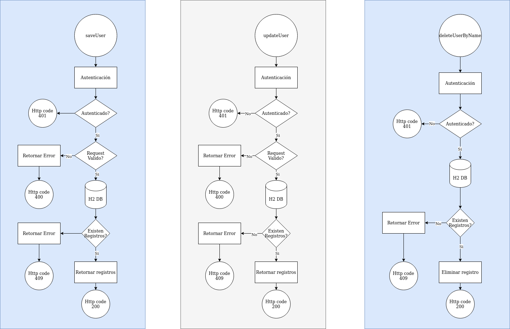

# bci-crud-users-v1
- Al iniciar el servicio se ejecutan los archivos #schema.sql y data.sql
- Diagrama 1 https://raw.githubusercontent.com/fpachecog/bci-crud-users-v1/master/Get Services.drawio.png

## Diagramas

